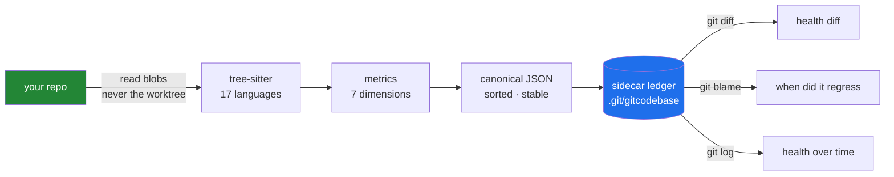
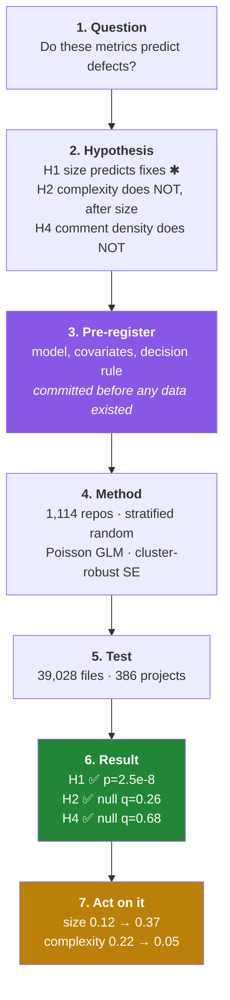
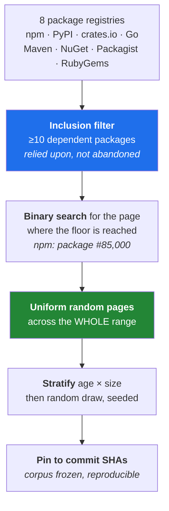

# gitcodebase

**A code observatory.** It measures the health of a repository and stores every
measurement **as real git objects** — so the history of your codebase's health is
itself version-controlled, diffable, blameable and bisectable.

```bash
npx gitcodebase
```

No install. No config. No signup. Nothing written to your working tree.

---

## The one thing that makes this different

Every other tool stores your code health in *their* database and hands you a
dashboard. gitcodebase stores it in **yours**, in git:

```console
$ git --git-dir=.git/gitcodebase/ledger.git diff HEAD~1 HEAD
```
```diff
   "complexity": {
-    "p90Cognitive": 10,
-    "score": 89.19
+    "p90Cognitive": 14,
+    "score": 78.21
   },
   "api/surface.json": {
-    "parseConfig": "(input: string) => Config"
+    "parseConfig": "(input: string, opts: Options) => Config"
   }
```

That is a health regression and a breaking API change, read straight out of a
`git diff`. Because snapshots are ordinary commits, the whole toolchain works on
your codebase's *health* the way it already works on your code:

| you already know | now also answers |
|---|---|
| `git log` | how has health moved over 200 commits? |
| `git blame` | **which commit** made this module complex, and who? |
| `git bisect` | find the commit that introduced the cycle |
| `git diff` | what did that refactor do to my architecture? |
| `git tag` | pin a baseline and measure drift against it |

---

## How it works



**The ledger is a bare sidecar repo** at `.git/gitcodebase/ledger.git` — a real
git repo, so the full toolchain works on it, but invisible to yours. `git status`
and `git log --all` stay clean.

> Custom refs under `refs/gitcodebase/*` were the obvious alternative and are the
> wrong answer: `git log --all` includes them, so the ledger would visibly
> pollute history in lazygit, GitKraken and tig.

Each snapshot is a commit whose tree **is** the analysis, sharded so diffs are
surgical:

```
manifest.json          analyzer version, source commit, languages
health.json            7 dimension scores, weights, what went unmeasured
files/<path>.json      per-file metrics  ← sharding makes diffs point at exact files
graph/modules.json     fan-in/out, instability, abstractness, cycles
api/surface.json       exported symbols  ← diffing this detects breaking changes
dup/clones.json        duplicated regions
coupling.json          files that change together
```

Analysis is cached by **git blob SHA**. Analysis of a blob is a pure function of
its content, and git already deduplicates by content — so an unchanged file is
never re-parsed, and backfilling hundreds of commits costs only the deltas.

---

## Are the metrics right?

This is the question the tool lives or dies on. Three different kinds of claim
get made, and they are **not** equally solid:

| claim | kind | status |
|---|---|---|
| "this function has cyclomatic complexity 8" | **fact** (McCabe 1976) | ✅ verified against ESLint, 8/8 |
| "complexity scores 52.5" | **opinion** built on thresholds | ✅ thresholds now measured |
| "overall health 70.5" | **opinion** built on weights | ⚠️ partly measured, partly judgement |

### The scientific method, applied



✱ H1 is the **positive control**. A pipeline that cannot recover the
best-replicated finding in the field has no business reporting a null.

**Pre-registration is the load-bearing step.** The hypotheses, model, fix-commit
regex and decision rule were written and committed *before any data was
collected* — the commit timestamps prove the ordering. An analysis chosen after
seeing its outcome can be made to support almost anything.

📄 [PREREGISTRATION.md](calibration/PREREGISTRATION.md) · 📊 [RESULTS.md](calibration/RESULTS.md) · 🔬 [CALIBRATION.md](CALIBRATION.md)

### How the corpus was sampled

The sampling design is the part most able to quietly determine its own answer,
so it is mechanical and seeded rather than curated.



**Dependents is an inclusion filter, not a ranking** — and this distinction
caught a real bug. The first implementation sorted by dependent count and took
the top pages, which returned rollup (130k dependents) and eslint-plugin-react
(105k): megaprojects with full-time maintainers and mandatory review, whose
distributions would set thresholds no ordinary codebase could meet.

Probing showed the floor of 10 dependents isn't reached until roughly package
**#85,000** on npm. The top 600 was the first **0.7%** of the eligible
population.

| | before fix | after fix |
|---|---|---|
| median dependents (npm) | tens of thousands | **38** |
| sample character | React, Angular, rollup | ordinary packages |

**Explicitly rejected sampling signals**, and why:

- ⭐ **GitHub stars** — popularity is not engineering quality
- 👀 **"looks clean to me"** — smuggles the conclusion into the premise
- 🏆 **top-N by anything** — a sample of outliers

### Validation, strongest evidence first

**1. Differential** — cyclomatic complexity cross-checked against ESLint 9's
`complexity` rule across 8 constructs: **8/8 agreement**. Two implementations
written independently from the same published definition agreeing is
corroboration. A tool grading its own homework is not.

**2. Ground truth** — fixtures whose answer is derivable by hand from McCabe's
definition.

**3. Metamorphic** — invariants that hold regardless of the right answer:
reformatting, renaming and comment edits must not move complexity; each added
branch must raise it by exactly one. These need no ground truth and catch whole
classes of bug.

**What is not claimed:** construct validity. Whether complexity *should* predict
defects is an open question in the literature and no test suite settles it.

---

## What the study found

### Measured thresholds (good / warn / bad)

`good` = p75, `warn` = p90, `bad` = p99 of real code. So a score says something
falsifiable: *worse than 90% of comparable real-world code.*

| language | cyclomatic | cognitive | functions | projects |
|---|---|---|---|---|
| python | 3 / 6 / 19 | 5 / 12 / 48 | 119,690 | 204 |
| typescript | 3 / 5 / 19 | 3 / 9 / 44 | 111,332 | 120 |
| javascript | 3 / 6 / 24 | 3 / 10 / 53 | 84,813 | 173 |
| tsx | 2 / 4 / 13 | 2 / 5 / 24 | 36,869 | 45 |
| **previously asserted** | **5 / 10 / 20** | **7 / 15 / 30** | — | — |

**The old thresholds were ~2× too lenient.** `good=5` sat above every measured
language's p75. A function the tool called acceptable was, in most languages,
already worse than three quarters of real code. McCabe's limit of 10 is
defensible for the 1976 FORTRAN it came from — and simply wrong for modern
JS/TS/Python.

### Only size predicts defects

| metric | IRR/SD | q | verdict |
|---|---|---|---|
| **log(LOC)** | — | **p=2.5e-8** | ✅ robust predictor |
| maxNesting | 1.097 | 0.053 | ✗ |
| maxCyclomatic | 1.020 | 0.26 | ✗ |
| maxCognitive | 1.020 | 0.26 | ✗ |
| commentRatio | 1.010 | 0.68 | ✗ |
| crypticIdentifierRatio | 1.013 | 0.68 | ✗ |

**⚠️ The pilot was wrong, and the full run caught it.** At 19 projects,
cyclomatic complexity looked significant at q=7.7e-5. At 386 projects it is
q=0.26. Cluster-robust standard errors are *anti-conservative when clusters are
few* — roughly 40+ are needed before the estimator can be trusted. Every
complexity "finding" the pilot produced was an artefact of cluster count.

**This does not mean complexity is meaningless** — only that it does not predict
*this* outcome, measured *this* way, beyond size. The fix signal carries a
**measured 46.7% false-positive rate** (30 hand-labelled commits), which being
non-differential biases estimates *toward* the null. These results are
conservative. Complexity stays fully measured and displayed: **the rule governs
what is scored, not what is shown.**

---

## Usage

```bash
gitcodebase                 # health now, including uncommitted work
gitcodebase scan            # snapshot HEAD into the ledger
gitcodebase backfill        # build health history from past commits
gitcodebase log             # health over time, as a git-style rail
gitcodebase diff            # what changed about the codebase's health
gitcodebase watch           # continuously review changes in the background
gitcodebase serve           # open the observatory UI
gitcodebase mcp             # run as an MCP server for coding agents
```

`gitcodebase check --fail-under 70` exits non-zero — a CI gate or a git hook.

### For coding agents (MCP)

```json
{ "mcpServers": { "gitcodebase": { "command": "npx", "args": ["gitcodebase", "mcp"] } } }
```

Five tools: `check_health`, `find_existing`, `check_duplication`,
`check_structure`, `review_changes`.

**`find_existing` is the one that matters.** The characteristic failure of
AI-assisted development isn't bad code — each turn produces something that
works. It's the *third* near-identical helper, written because the agent had no
memory of the first two. Asking *"does this already exist?"* **before** writing
turns duplication detection from a diagnosis into prevention.

### After every agent turn

```json
{ "hooks": { "Stop": [{ "hooks": [{ "type": "command", "command": "npx gitcodebase hook --quiet" }] }] } }
```

```console
health 83.8  ▼ -0.9  3 files changed  dup: score.js ↔ api.js
```

Silent unless the score actually moves.

---

## Why not just ESLint?

For a point-in-time check of a JS/TS repo, `eslint` + `eslint-plugin-sonarjs` +
`jscpd` + `dependency-cruiser` covers most of the *static* metrics here. If
that's all you need, use them.

What they structurally cannot do:

| | ESLint | gitcodebase |
|---|---|---|
| state right now | ✅ | ✅ |
| **complexity went 12 → 31, in which commit** | ❌ no memory | ✅ |
| fan-in/out, cycles, architectural drift | ❌ per-file by design | ✅ |
| **files that change together with no import** | ❌ blind to git | ✅ |
| a health picture rather than a violation wall | ❌ | ✅ |
| languages | JS/TS | 17 |

ESLint *agreeing* with these numbers is a feature. The competition isn't over
whether complexity can be computed — that's solved and verifiable. It's over
what you do with it across time.

---

## Status

✅ Ledger engine · analyzer · 7 dimensions · CLI · MCP server · HTTP API ·
observatory UI · watch mode · Claude Code hook · **calibrated thresholds**

48 tests passing. Dogfooded on 1,100+ repositories.

**Honest gaps:**
- Weights for duplication, standards, extensibility and coverage are **untested** —
  no outcome model was fitted for them. `WEIGHT_PROVENANCE` marks which weights
  are evidence and which are judgement.
- Symbol navigation and reference search — deferred with the tree-sitter
  decision; syntax-only parsing makes cross-file resolution heuristic
- Publishing the ledger to a remote, so a team shares one health history

## Development

```bash
npm install && npm test
node bin/gitcodebase.mjs
```

Node 22+ and git. Grammars come from `@vscode/tree-sitter-wasm` — **not**
`tree-sitter-wasms`, which is built against an older ABI and fails to load.
